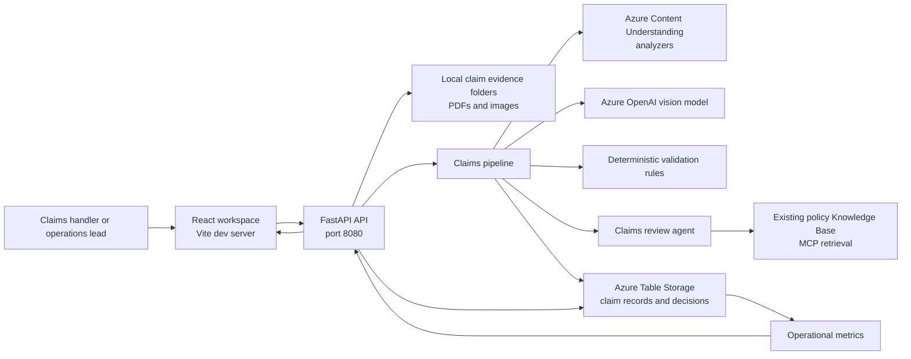
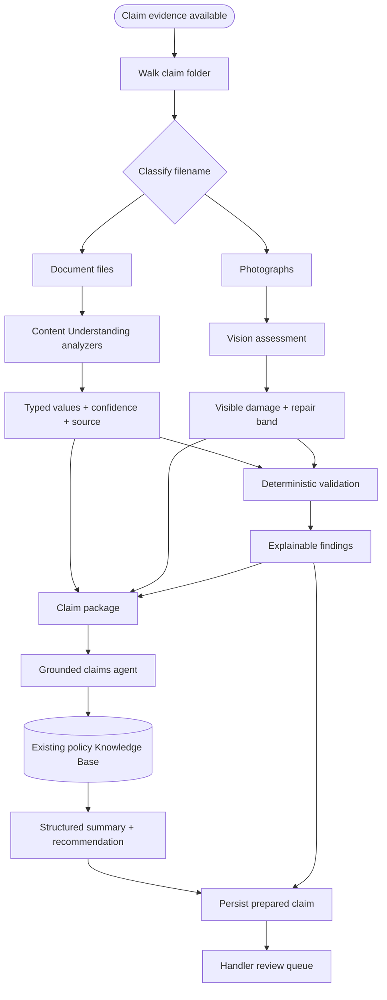
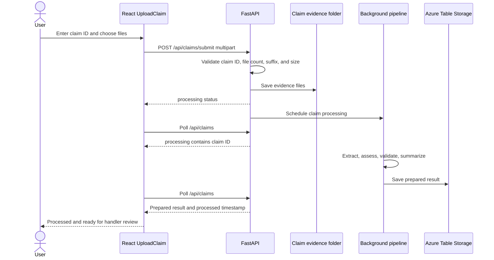
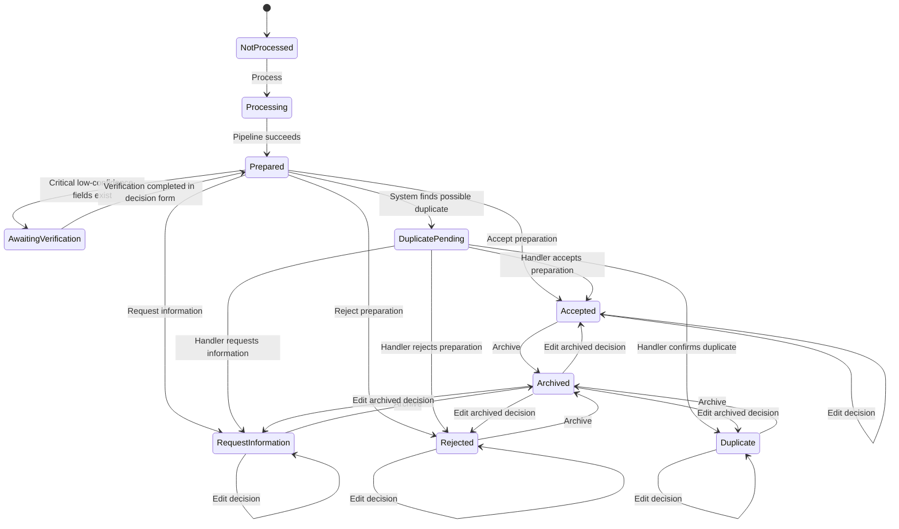
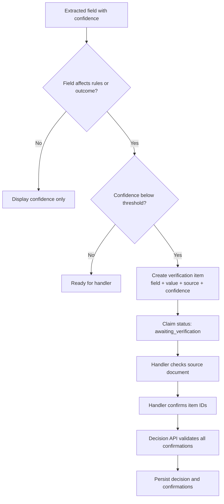
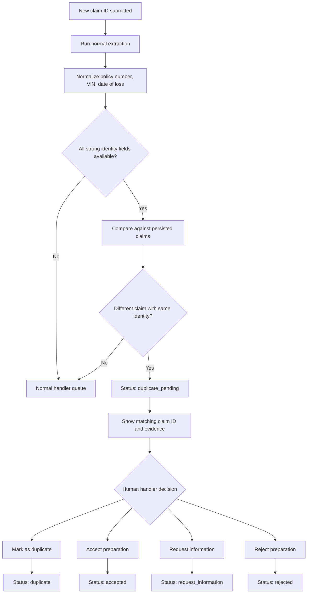
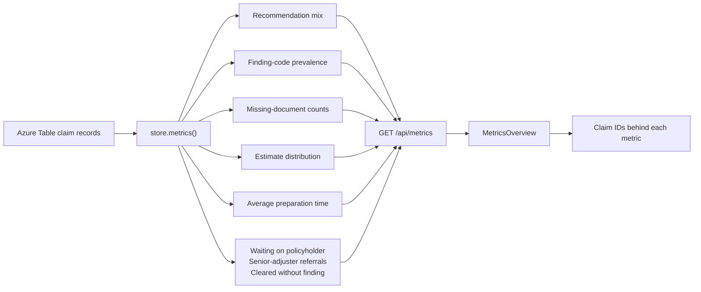
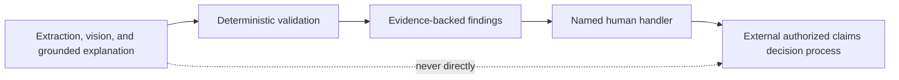

# Claims Workspace Architecture and Flowcharts

This document contains the architecture diagrams for the Contoso Claims Processing Workspace. 

## 1. System Architecture

## 2. Original Claim-Preparation Flow

## 3. Upload and Reprocessing Flow

## 4. Handler Decision Lifecycle

## 5. Low-Confidence Verification Flow

## 6. Duplicate Detection and Human Review

## 7. Metrics Flow

## 8. File-to-Flow Mapping

```mermaid
flowchart TD
    Config[backend/config.py] --> Services[Service endpoints, table names, limits]
    Analyzers[backend/analyzers.py] --> Extract[Document extraction]
    CU[backend/content_understanding.py] --> Extract
    Vision[backend/vision.py] --> Photos[Photo assessment]
    Validation[backend/validation.py] --> Rules[Deterministic findings]
    Verification[backend/verification.py] --> Human[Verification workflow]
    Agent[backend/claims_agent.py] --> Grounding[Grounded review]
    Pipeline[backend/pipeline.py] --> Orchestration[End-to-end orchestration]
    Store[backend/store.py] --> Persistence[Claims, decisions, metrics]
    API[backend/api.py] --> Endpoints[HTTP endpoints]
    Upload[frontend/src/components/UploadClaim.jsx] --> API
    List[frontend/src/components/ClaimList.jsx] --> Queue[Lifecycle sections]
    Detail[frontend/src/components/ClaimDetail.jsx] --> Evidence[Claim evidence and findings]
    Decision[frontend/src/components/DecisionPanel.jsx] --> Human
    Overview[frontend/src/components/MetricsOverview.jsx] --> Metrics[Operations dashboard]
    Orchestration --> Extract
    Orchestration --> Photos
    Orchestration --> Rules
    Orchestration --> Grounding
    Rules --> Persistence
    Grounding --> Persistence
    Endpoints --> Persistence
    Queue --> Endpoints
    Evidence --> Endpoints
    Human --> Endpoints
    Metrics --> Endpoints
```

## 9. Safety Boundary

The application prepares, explains, verifies, refers, and records handler actions. It does not approve, decline, pay, or allege fraud autonomously.
